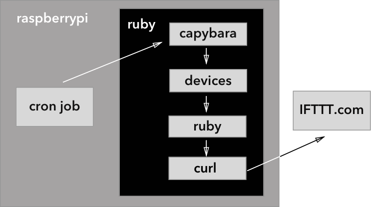

# MarcoPolo
An app that tells you who's home through the router

# Summary  
Devices can be used to monitor the activity of people in an environment. This tool will monitor the attached devices and provide a notification system. This will be first used to make requests to web APIs and later to connect to other IoT displays.  

# Goals  
Monitor network attached devices via Ruby webserver on a raspberry pi. When a device is added or removed from the network send notifications to configured APIs.

# Process  
* Capybara with phantomjs to navigate the webpage
* Ruby file for the code
* yaml for config
* pry for testing things out
* curl for web request
* Cron to run the ruby file every 5 minutes
* IFTTT.com to send a email when a change was detected
* Github to get my project onto the pi
* raspberrypi to house the project  

# Installation
Comcast router
raspberrypi 2 Model B arm7  
ssh into the pi with the terminal

###Capybara   
* Cheat Sheet: https://gist.github.com/zhengjia/428105
* Useful related tutorial includes pry: http://tutorials.jumpstartlab.com/topics/scraping-with-capybara.html

###raspberrypi  
to log in to your raspberrypi:
ssh pi@ipaddress
(which you can find on the router)

to find out which pi you have:
in the terminal:
``cat /proc/cpuinfo``
the revision number will tell you which version you have in the table here:
http://elinux.org/RPi_HardwareHistory#Board_Revision_History

to install ruby capybara poltergeist phantomjs
don't install the gems with sudo just with gem install
you have to install rvm
``sudo apt-get install ruby-dev``
``\curl -sSL https://get.rvm.io | bash``
``source /home/pi/.rvm/scripts/rvm ``
``rvm install 2.4``

``gem install capybara``
``gem install poltergeist ``

Phantomjs was difficult to get on the pi:

// from the laptop
``curl -O https://github.com/fg2it/phantomjs-on-raspberry/releases/download/v2.1.1-wheezy-jessie/phantomjs_2.1.1_armhf.deb``

``scp phantomjs_2.1.1_armhf.deb pi@10.0.0.19:``
note that colon at the end :)

// on pi

``sudo dpkg -i phantomjs_2.1.1_armhf.deb``
``source ~/.bash``

``phantomjs —version``

###crontab  
in terminal: to access the crontab   
  ``  env EDITOR=nano crontab -e  ``  
in crontab - Runs every 5 minutes  
   ``  */5 * * * * /bin/bash -l -c 'cd ~/Pathto/theFolder/ ; ruby marcoPolo.rb'  ``  
  you have to wrap the ruby to make it run as if from the login shell and from a string  

###IFTTT
It was tricky to navigate:  
* In 'My Applets' go to 'New Applet' button on the right (window has to be wide enough or it will disappear!) and then click on the blue '+this' text search for 'Maker Webhooks' and set up your events and triggers.
* In 'Search' enter 'Maker' and on the 'Maker Webhooks' page go to the settings on top right. Go to the URL they give you to trigger an event and get the curl code.  

###Notes  
the iphones are set with wi-fi assist by default which bumps them off the network if they perceive the signal to be too week. Can be changes under Settings/Cellular, at the very bottom.
Still have a haunted laptop that likes to wake up in the middle of the night. That mystery is not yet solved...
